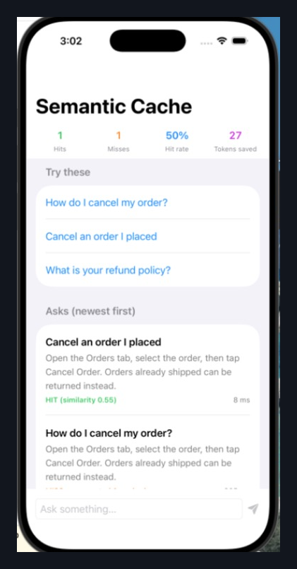

# SemanticCacheKit — an on-device semantic cache for LLM-backed iOS features

Lookups match by **embedding similarity**, not string equality — so *"Cancel an order I placed"* can be served by the answer already generated for *"How do I cancel my order?"*, in milliseconds, for zero tokens.

This repo is the runnable companion to the article
**Article: [Your Next iOS System Design Interview Won't Ask About Image Caches. It'll Ask About Semantic Ones.](https://medium.com/p/cc477c3fdfc5)**



*Real Simulator capture from this exact project — the miss paid 945 ms and burned tokens; the reworded prompt got the same answer in 8 ms for free.*

## What's inside

- **`SemanticCache`** — an actor, so concurrent lookups can't race the LRU bookkeeping. Similarity-threshold hits, LRU eviction, capacity-0 kill switch, and metrics that track the number a lead actually reports: estimated tokens saved.
- **`EmbeddingVector`** — bounds-safe cosine similarity that returns `Double?`: dimension mismatches and zero-magnitude vectors are *"can't compare"* (`nil`), never "similarity 0". Collapsing those two is how a semantic cache gets confidently wrong.
- **`Embedder` protocol** — the seam where a real model plugs in (`NLContextualEmbedding` on-device, an MLX encoder, or a remote embeddings API).
- **`HashingEmbedder`** — a deterministic bag-of-words stand-in (FNV-1a → buckets) so the cache is fully testable on any platform, including Linux CI, with zero model downloads. It is deliberately *not* semantic — swap in a real embedder for production meaning-matching.

```swift
let cache = SemanticCache(
    embedder: HashingEmbedder(dimension: 128),
    capacity: 32,
    similarityThreshold: 0.50 // calibrated to THIS embedder — see below
)

switch await cache.lookup("Cancel an order I placed") {
case .hit(let cached, let similarity):
    show(cached.response) // 8 ms, 0 tokens
case .miss:
    let answer = await callModel(prompt) // 945 ms, N tokens
    await cache.store(CachedResponse(prompt: prompt, response: answer, estimatedTokens: tokens))
}
```

## The threshold story (learned live, on Simulator)

The demo originally shipped with `similarityThreshold: 0.62`. On the first real Simulator run, the app's own suggested rephrase — *"Cancel an order I placed"* vs the cached *"How do I cancel my order?"* — scored **0.548**. A miss, on the exact pair the UI invites you to try.

The number wasn't wrong in general; it was wrong *for this embedder*. Bag-of-words rephrasings share less vocabulary than intuition suggests, so this repo runs at **0.50**. Production gateways using real embedding models sit at **0.90–0.98**. Same architecture, wildly different constant — because the threshold is a calibration artifact of the model behind it, not a constant. Swap the embedder, re-calibrate, or your hit rate silently collapses.

## How to run it

1. Clone this repo
2. Open `Demo/Demo.xcodeproj`
3. Pick any iOS Simulator, **Build & Run** — no other setup

The `Demo` app consumes the library via a **local Swift Package reference** (`XCLocalSwiftPackageReference`, relative path `..`), so one clone gets you everything. Tap the first suggestion (MISS → generated, ~900 ms simulated model latency), then the second (semantic HIT, single-digit ms).

## Verification, stated honestly

- `swift build` and `swift test` run for real on Swift 6.0.3 (Linux): **33/33 tests passing** — cosine edge cases (dimension mismatch, zero vectors, clamping), embedder determinism, LRU eviction order, capacity/threshold clamping, metrics, empty-prompt safety, and a 100-task concurrency smoke test.
- The demo app was **run on a real iOS Simulator (iPhone 17 Pro, iOS 26.3)** via Xcode 26.3, and the screenshots in `Demo/Screenshots/` are real captures from that run — including the run that exposed the 0.62→0.50 threshold bug above.
- `Package.swift` declares only a library + test target (no `.executableTarget`); the runnable app lives in `Demo.xcodeproj`, which is the reproducible-launch pattern this pipeline settled on after an earlier `.executableTarget` demo crashed on launch 100% of the time.

## Where the design is honest about its limits

`lookup` is a linear scan. For an on-device response cache capped in the hundreds of entries, an ANN index (HNSW etc.) buys sublinear search at the cost of build time, memory, and a dependency it will never earn back at this scale. If your corpus is bigger than your cache, that trade flips — and that sentence is the system-design-interview answer this repo exists to demonstrate.
